Create your first Java function in Azure using IntelliJ
=======================================================

In this article
---------------

This article shows you how to use Java and IntelliJ to create an Azure function.

Specifically, this article shows you:

*   How to create an HTTP-triggered Java function in an IntelliJ IDEA project.
*   Steps for testing and debugging the project in the integrated development environment (IDE) on your own computer.
*   Instructions for deploying the function project to Azure Functions.

Prerequisites
-------------

*   An Azure account with an active subscription. [Create an account for free](https://azure.microsoft.com/free/?ref=microsoft.com&utm_source=microsoft.com&utm_medium=docs&utm_campaign=visualstudio).
*   An [Azure supported Java Development Kit (JDK)](/en-us/azure/developer/java/fundamentals/java-support-on-azure), version 8, 11, 17 or 21. (Java 21 is currently only supported in preview on Linux only)
*   An [IntelliJ IDEA](https://www.jetbrains.com/idea/download/) Ultimate Edition or Community Edition installed
*   [Maven 3.5.0+](https://maven.apache.org/download.cgi)
*   Latest [Function Core Tools](https://github.com/Azure/azure-functions-core-tools)

Install plugin and sign in
--------------------------

To install the Azure Toolkit for IntelliJ and then sign in, follow these steps:

1.  In IntelliJ IDEA's **Settings/Preferences** dialog (Ctrl+Alt+S), select **Plugins**. Then, find the **Azure Toolkit for IntelliJ** in the **Marketplace** and click **Install**. After it's installed, click **Restart** to activate the plugin.

    [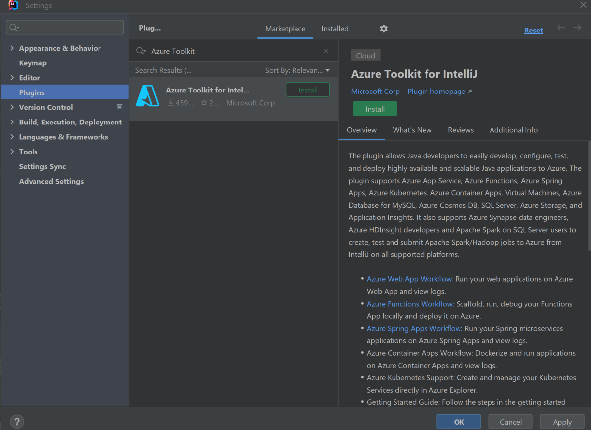](media/functions-create-first-java-intellij/marketplace.png#lightbox)

2.  To sign in to your Azure account, open the **Azure Explorer** sidebar, and then click the **Azure Sign In** icon in the bar on top (or from the IDEA menu, select **Tools > Azure > Azure Sign in**).

    [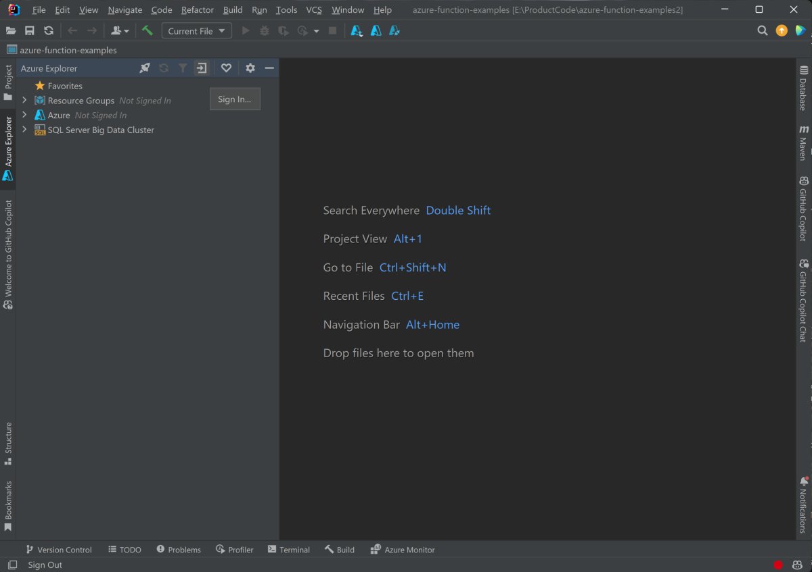](media/functions-create-first-java-intellij/intellij-azure-login.png#lightbox)

3.  In the **Azure Sign In** window, select **OAuth 2.0**, and then click **Sign in**. For other sign-in options, see [Sign-in instructions for the Azure Toolkit for IntelliJ](/en-us/azure/developer/java/toolkit-for-intellij/sign-in-instructions).

    [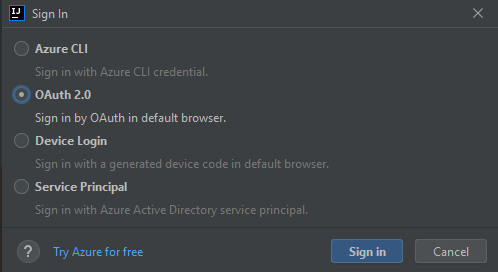](media/functions-create-first-java-intellij/intellij-azure-login-popup.png#lightbox)

4.  In the browser, sign in with your account and then go back to IntelliJ. In the **Select Subscriptions** dialog box, click on the subscriptions that you want to use, then click **Select**.

    [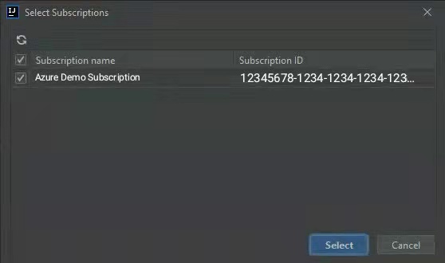](media/functions-create-first-java-intellij/intellij-azure-login-selectsubs.png#lightbox)

Create your local project
-------------------------

To use Azure Toolkit for IntelliJ to create a local Azure Functions project, follow these steps:

1.  Open IntelliJ IDEA's **Welcome** dialog, select **New Project** to open a new project wizard, then select **Azure Functions**.

    [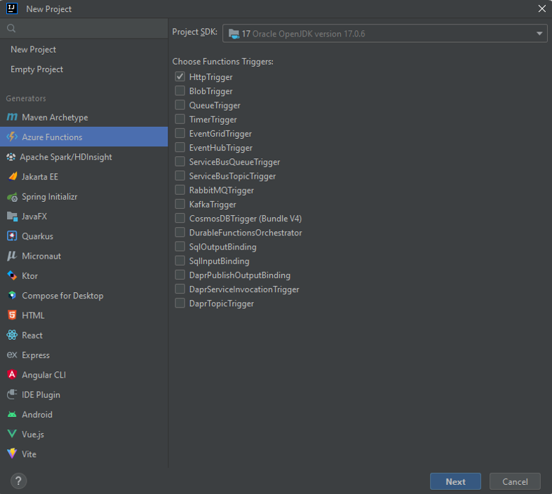](media/functions-create-first-java-intellij/create-functions-project.png#lightbox)

2.  Select **Http Trigger**, then click **Next** and follow the wizard to go through all the configurations in the following pages. Confirm your project location, then click **Finish**. Intellj IDEA will then open your new project.

    [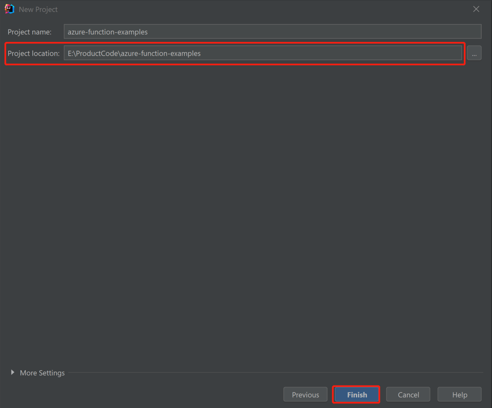](media/functions-create-first-java-intellij/create-functions-project-finish.png#lightbox)

Run the project locally
-----------------------

To run the project locally, follow these steps:

Important

You must have the JAVA\_HOME environment variable set correctly to the JDK directory that is used during code compiling using Maven. Make sure that the version of the JDK is at least as high as the `Java.version` setting.

1.  Navigate to _src/main/java/org/example/functions/HttpTriggerFunction.java_ to see the code generated. Beside the line _24_, you'll notice that there's a green **Run** button. Click it and select **Run 'Functions-azur...'**. You'll see that your function app is running locally with a few logs.

    [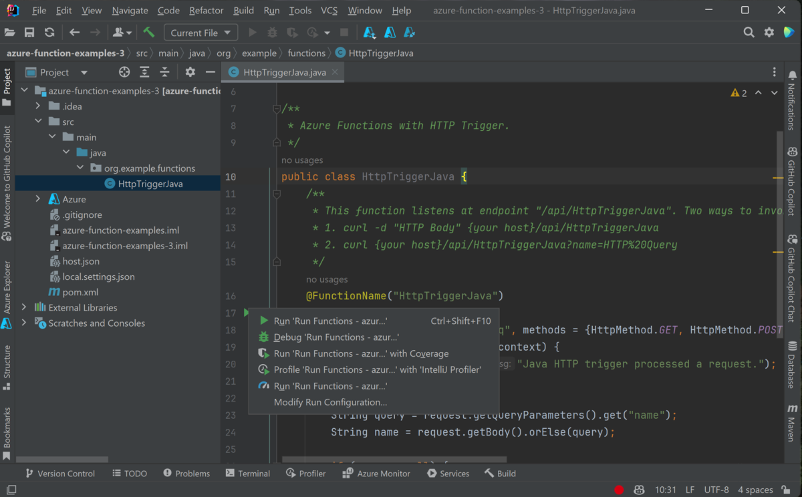](media/functions-create-first-java-intellij/local-run-functions-project.png#lightbox)

    [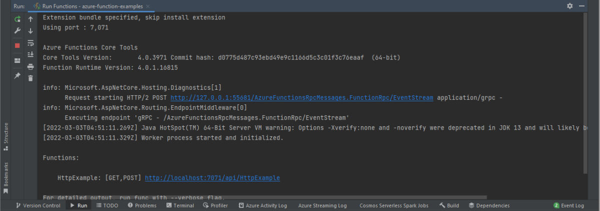](media/functions-create-first-java-intellij/local-run-functions-output.png#lightbox)

2.  You can try the function by accessing the displayed endpoint from browser, such as `http://localhost:7071/api/HttpExample?name=Azure`.

    [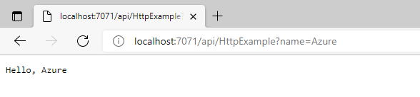](media/functions-create-first-java-intellij/local-run-functions-test.png#lightbox)

3.  The log is also displayed in your IDEA. Stop the function app by clicking the **Stop** button.

    [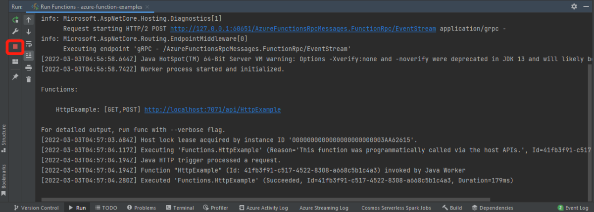](media/functions-create-first-java-intellij/local-run-functions-log.png#lightbox)

Debug the project locally
-------------------------

To debug the project locally, follow these steps:

1.  Select the **Debug** button in the toolbar. If you don't see the toolbar, enable it by choosing **View** > **Appearance** > **Toolbar**.

    [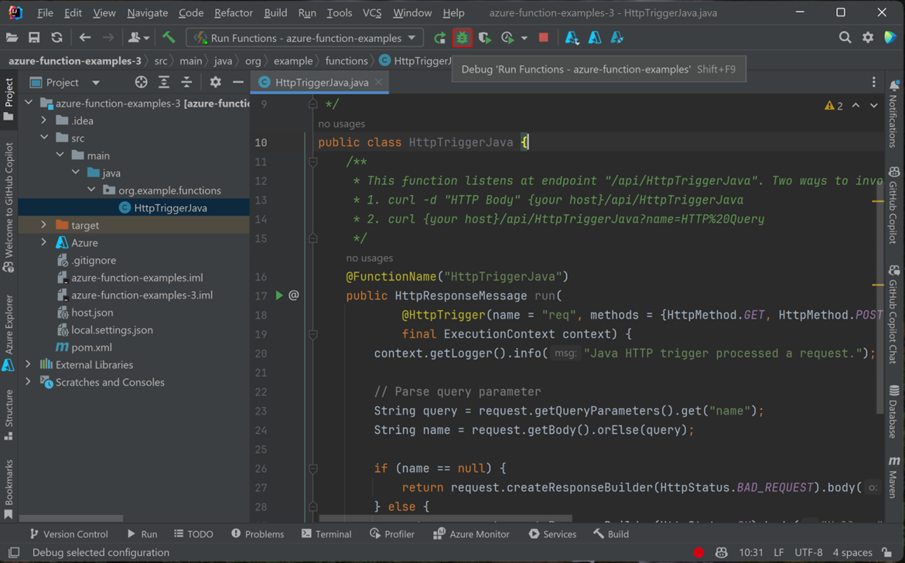](media/functions-create-first-java-intellij/local-debug-functions-button.png#lightbox)

2.  Click on line _20_ of the file _src/main/java/org/example/functions/HttpTriggerFunction.java_ to add a breakpoint. Access the endpoint `http://localhost:7071/api/HttpTrigger-Java?name=Azure` again and you'll find the breakpoint is hit. You can then try more debug features like **Step**, **Watch**, and **Evaluation**. Stop the debug session by clicking the **Stop** button.

    [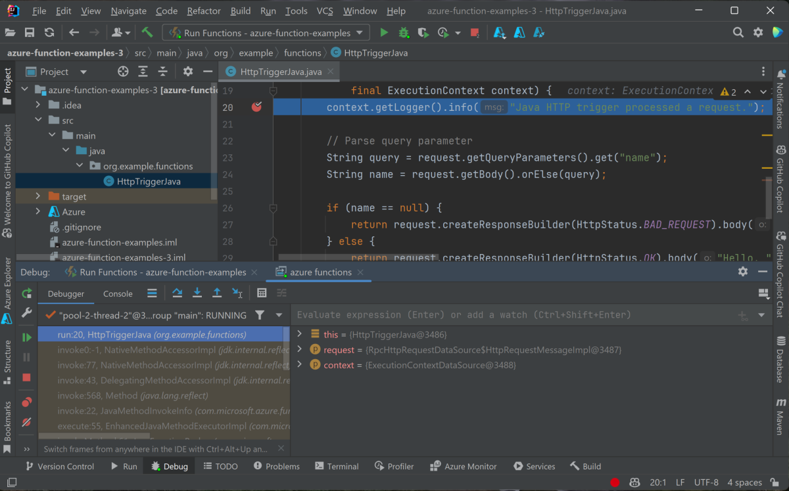](media/functions-create-first-java-intellij/local-debug-functions-break.png#lightbox)

Deploy your project to Azure
----------------------------

To deploy your project to Azure, follow these steps:

1.  Click and expand the Azure icon in IntelliJ Project explorer, then select **Deploy to Azure -> Deploy to Azure Functions**.

    [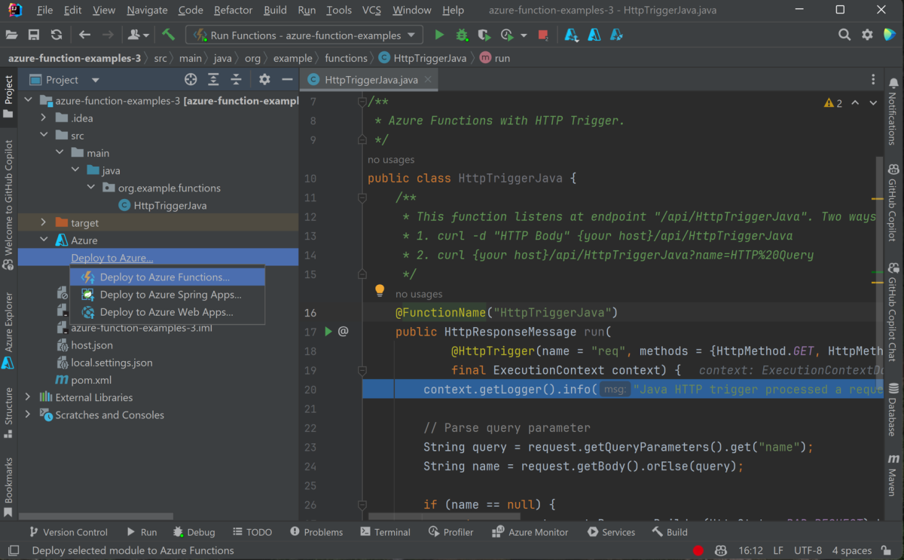](media/functions-create-first-java-intellij/deploy-functions-to-azure.png#lightbox)

2.  If you don't have any Function App yet, click **+** in the _Function_ line. Type in the function app name and choose proper platform. Here you can accept the default value. Click **OK** and the new function app you created will be automatically selected. Click **Run** to deploy your functions.

    [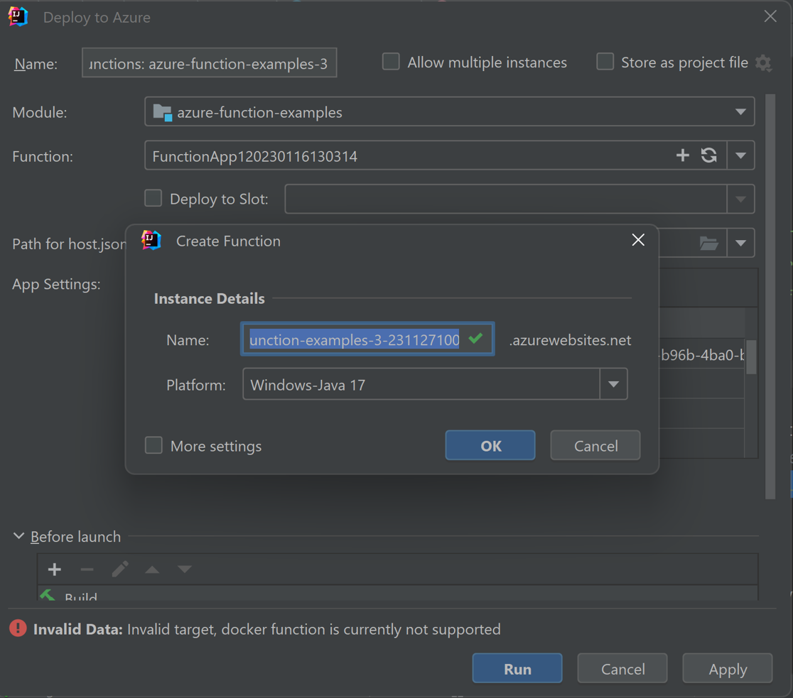](media/functions-create-first-java-intellij/deploy-functions-create-app.png#lightbox)

    [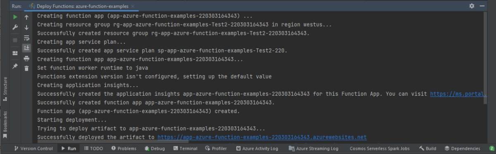](media/functions-create-first-java-intellij/deploy-functions-log.png#lightbox)

Manage function apps from IDEA
------------------------------

To manage your function apps with **Azure Explorer** in your IDEA, follow these steps:

1.  Click on **Function App** and you'll see all your function apps listed.

    [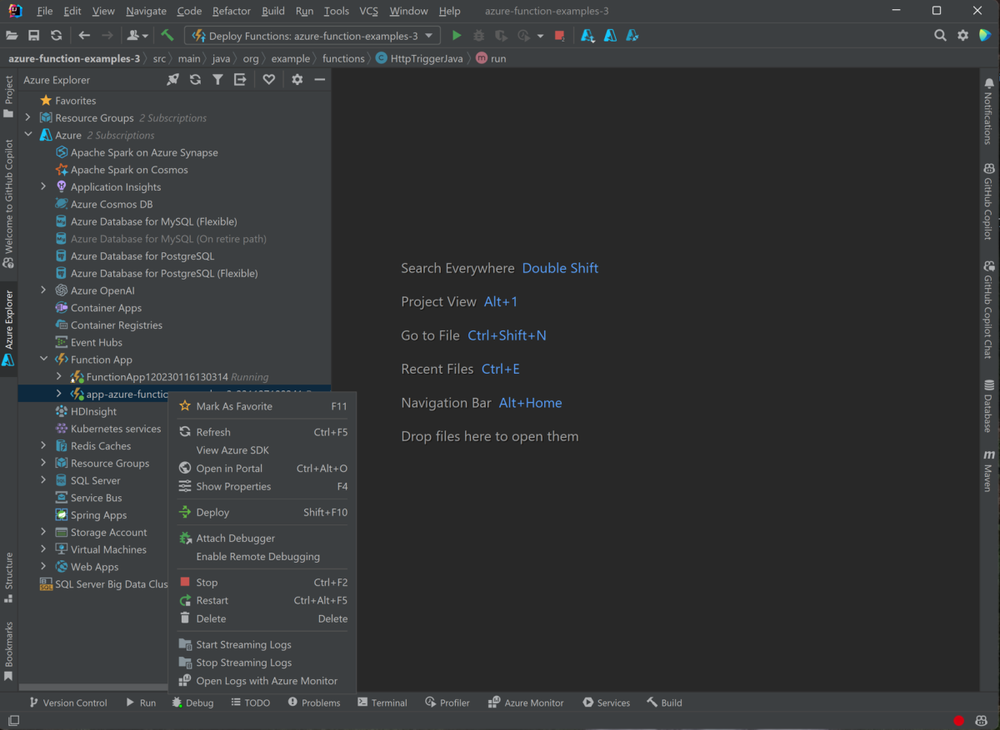](media/functions-create-first-java-intellij/explorer-view-functions.png#lightbox)

2.  Click to select on one of your function apps, then right click and select **Show Properties** to open the detail page.

    [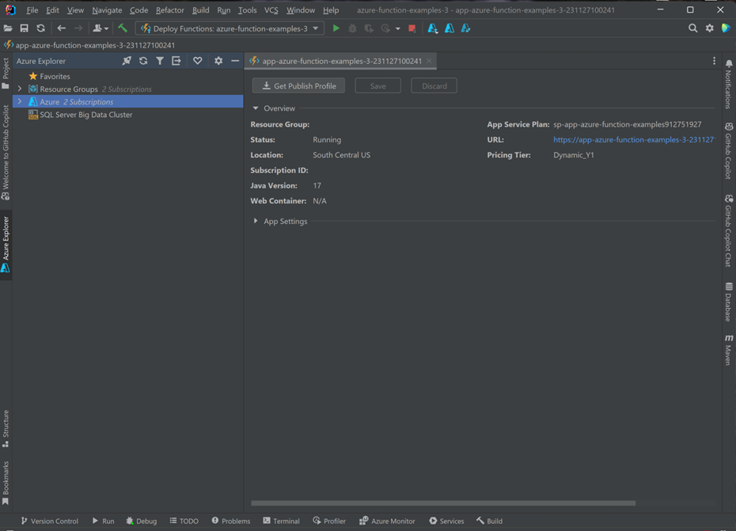](media/functions-create-first-java-intellij/explorer-functions-show-properties.png#lightbox)

3.  Right click on your **HttpTrigger-Java** function app, then select **Trigger Function in Browser**. You'll see that the browser is opened with the trigger URL.

    [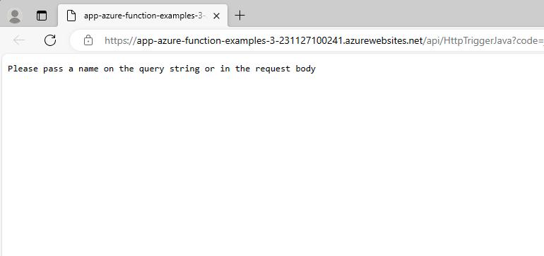](media/functions-create-first-java-intellij/explorer-trigger-functions.png#lightbox)

Add more functions to the project
---------------------------------

To add more functions to your project, follow these steps:

1.  Right click on the package **org.example.functions** and select **New -> Azure Function Class**.

    [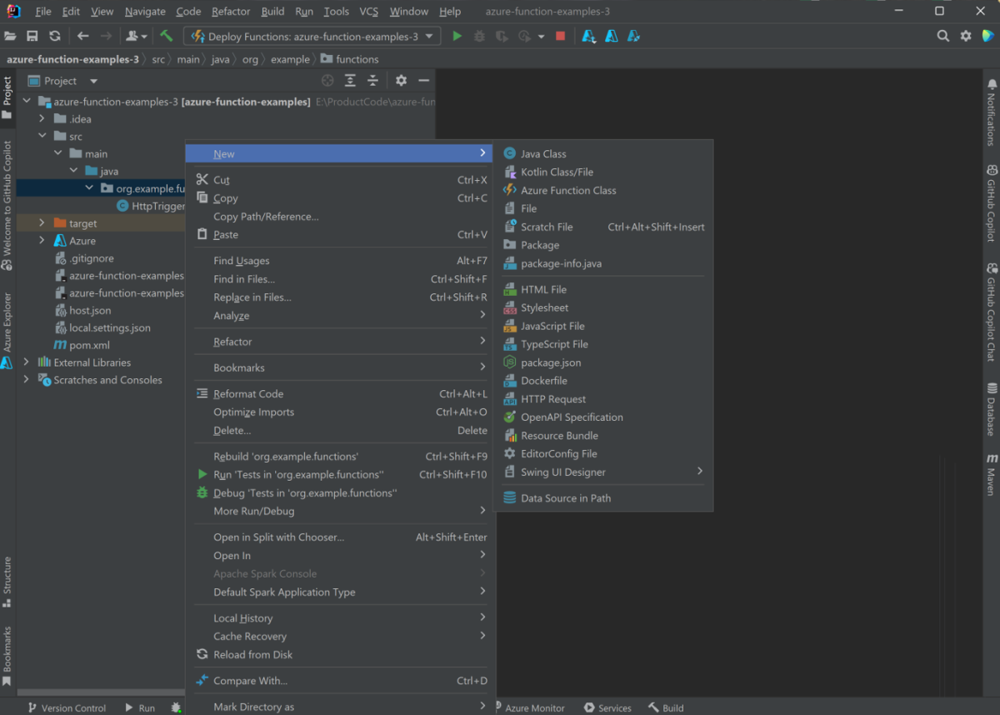](media/functions-create-first-java-intellij/add-functions-entry.png#lightbox)

2.  Fill in the class name **HttpTest** and select **HttpTrigger** in the create function class wizard, then click **OK** to create. In this way, you can create new functions as you want.

    [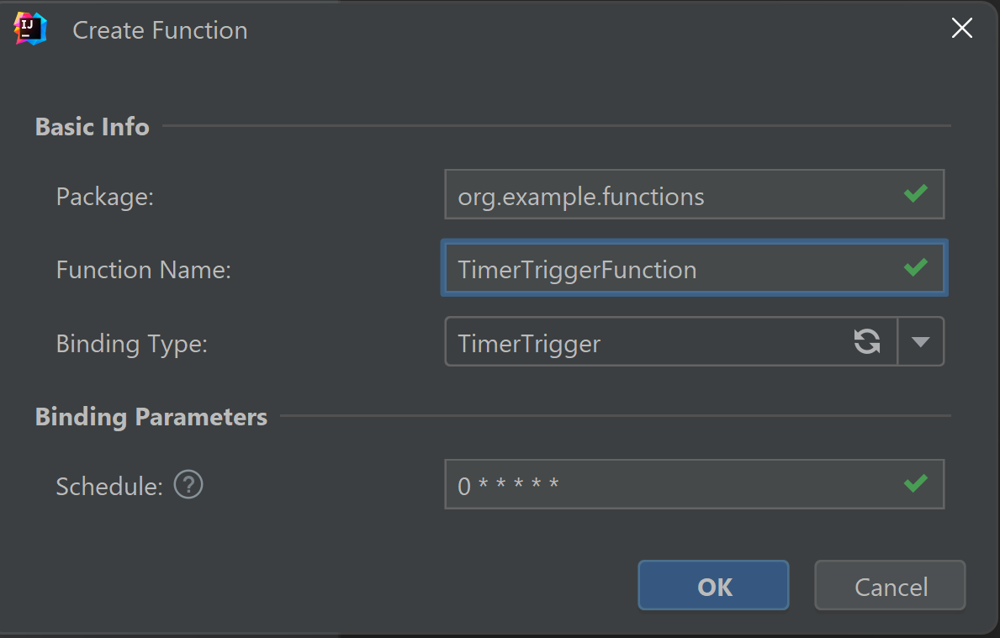](media/functions-create-first-java-intellij/add-functions-trigger.png#lightbox)

    [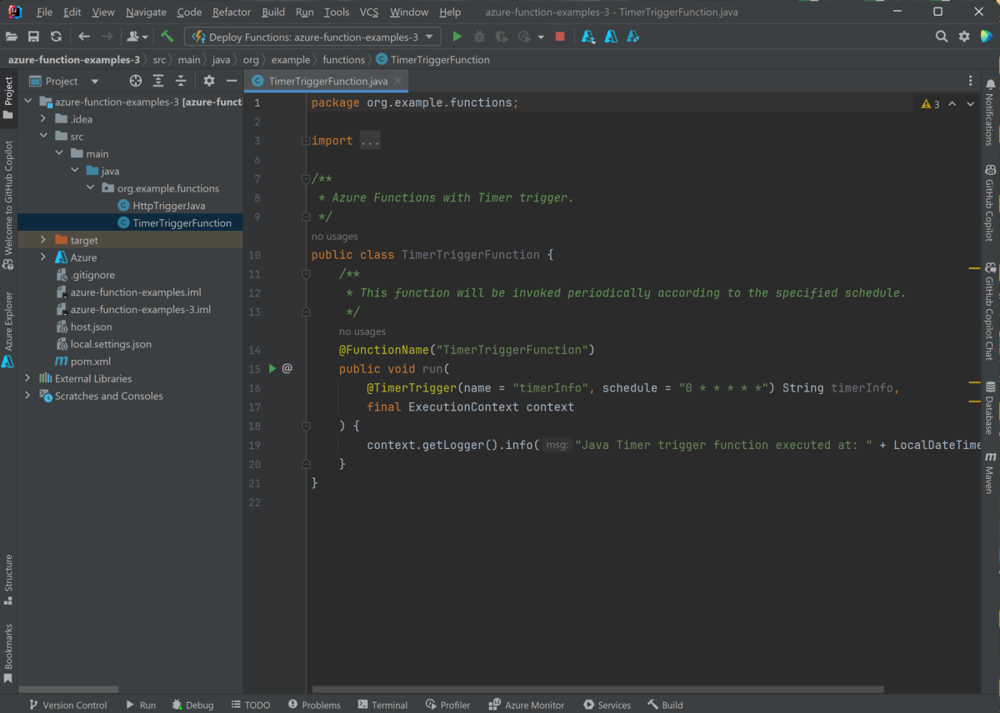](media/functions-create-first-java-intellij/add-functions-output.png#lightbox)

Cleaning up functions
---------------------

Select one of your function apps using **Azure Explorer** in your IDEA, then right-click and select **Delete**. This command might take several minutes to run. When it's done, the status will refresh in **Azure Explorer**.

[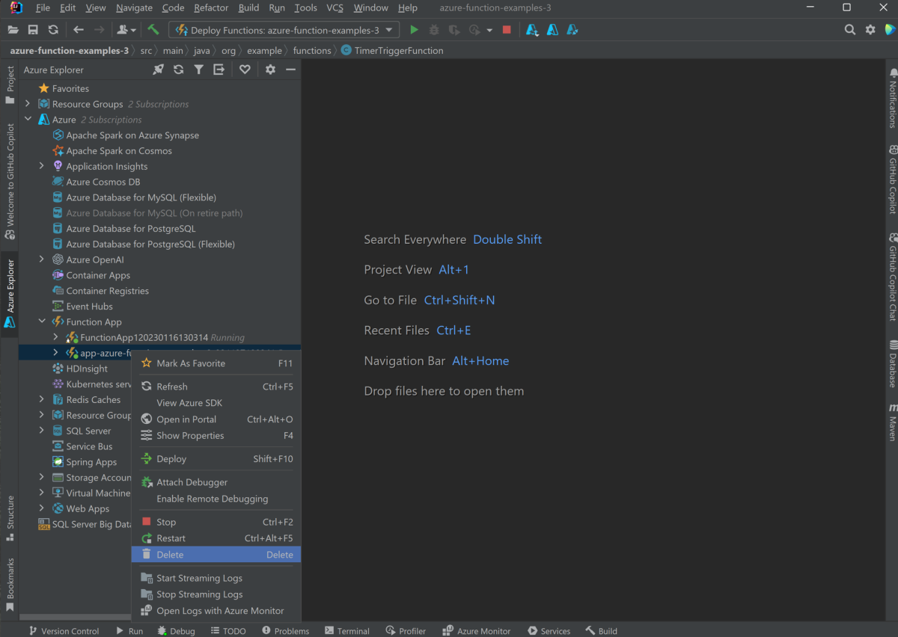](media/functions-create-first-java-intellij/delete-function.png#lightbox)
